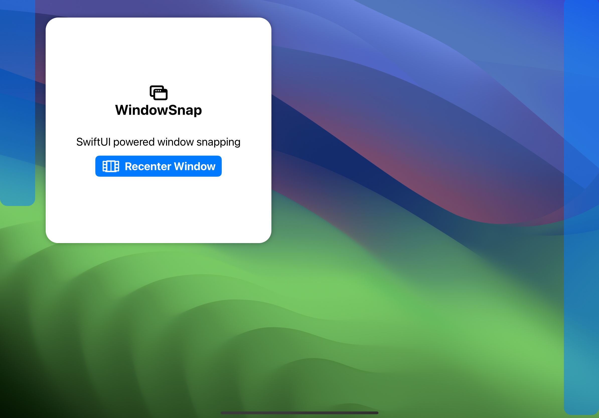

# WindowSnap
SwiftUI powered window snapping, inspired by Windows 11. Supports half screen and corners. 

## Demo
[Demo Video](https://twitter.com/vedantapps/status/1673124717551849472?s=61&t=fNVIxsdQaQwOWJ8R16zc0Q)

## Screenshots

  
  
  
  

